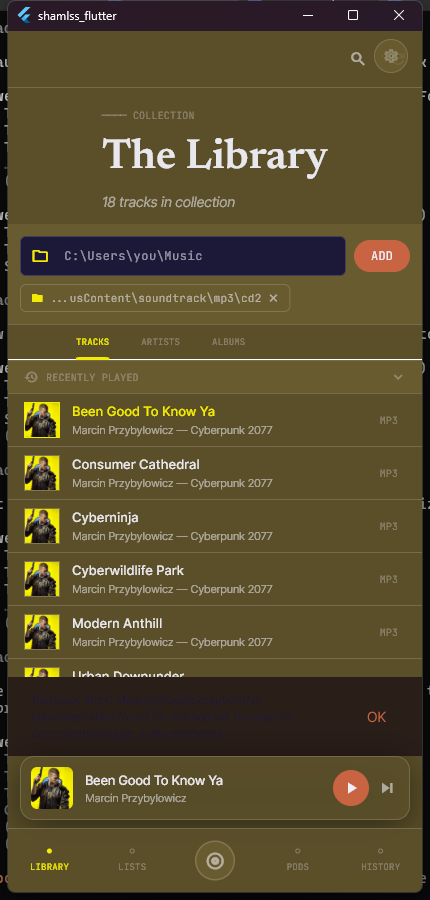
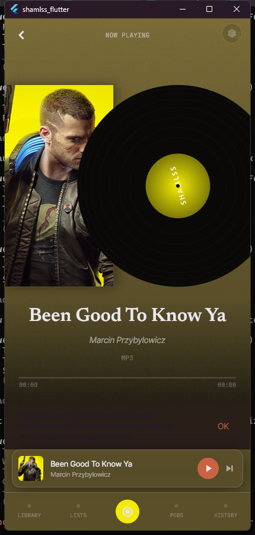
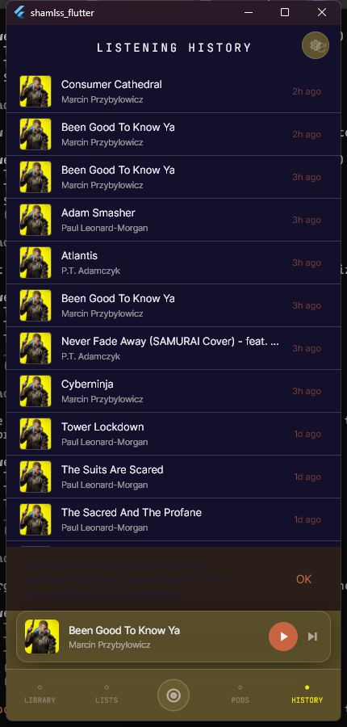
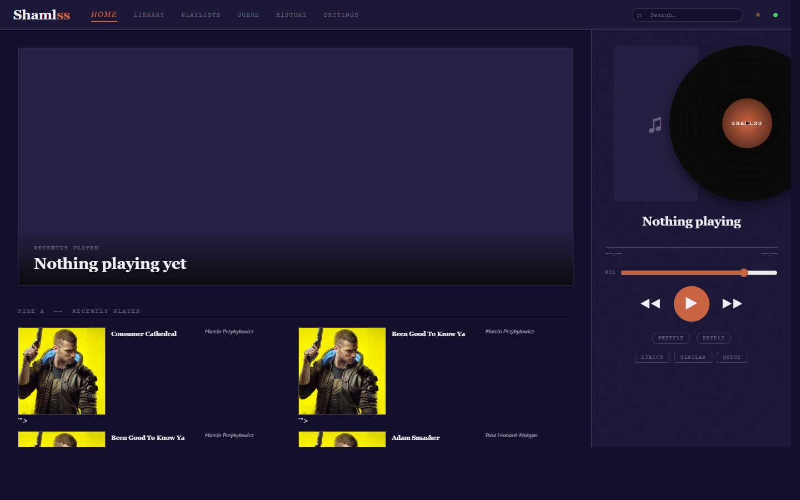

# Shamlss

**Self-Hosted Audio Music Library Streaming Service**

Stream your personal music library from your PC to your phone — over your home network or the internet. No cloud. No subscriptions. No accounts. Your music, your server, your rules.

> *"Shameless" — no shame in owning your stack.*

---

## Screenshots

<table>
  <tr>
    <td align="center"><b>Library</b></td>
    <td align="center"><b>Now Playing</b></td>
    <td align="center"><b>History</b></td>
  </tr>
  <tr>
    <td></td>
    <td></td>
    <td></td>
  </tr>
  <tr>
    <td align="center" colspan="3"><b>Web Player</b></td>
  </tr>
  <tr>
    <td colspan="3" align="center"></td>
  </tr>
</table>

> *The UI adapts its color palette to the currently playing track's album art.*

---

## What it is

Shamlss is a lightweight self-hosted music server + mobile/desktop client. You install a small daemon on your PC (Windows, Linux, or macOS), point it at your music folder, and stream to any device on your network using the Android app, the built-in web player, or the Windows desktop app.

**Everything runs on your own hardware.** Nothing is sent to any external server.

---

## Features

- **Music library management** — scan folders, auto-index audio files, album art, metadata
- **HTTP 206 range streaming** — gapless playback, seek anywhere instantly
- **Web player** — full browser UI at `http://localhost:7432/ui`, no install needed
- **Android app** — browse library, playlists, now playing, history, reactions, podcast controls
- **Windows desktop app** — Electron tray app that bundles the server + web player in one click
- **Playlists** — create and manage playlists from the app or web player
- **Podcast / audiobook support** — speed control, position resume, chapter markers, per-type tagging
- **Listening history** — recent plays with time-ago, tap to replay
- **Track reactions** — ❤️ 🔥 👏 😮 while you listen
- **Smart playlists** — mood-based, similar-track, auto-mix, smart shuffle
- **Collab queue** — multiple devices add to a shared queue
- **Listening parties** — synchronized playback across devices
- **Pod Chat** — text chat tied to a listening session
- **Multi-room** — cast playback to multiple rooms simultaneously
- **Offline cache** — pre-cache tracks on the mobile app for offline listening
- **LAN device discovery** — phones find your server automatically on the local network
- **Activity feed** — see what's been playing across devices
- **Track analysis** — BPM and waveform (requires ffmpeg)
- **Headless server mode** — run on any machine without a GUI (systemd / LaunchAgent / startup script)

---

## Requirements

| Component | Requirement |
|---|---|
| Server | Windows 10/11, Linux, or macOS |
| Server runtime | Node.js 18+ (bundled in the Windows installer) |
| Android app | Android 8.0+ |
| Web player | Any modern browser |
| Music files | MP3, FLAC, AAC, OGG, M4A, WAV, and more |
| Optional | ffmpeg (for BPM analysis and waveform generation) |

---

## Installation

### Windows — Desktop App (recommended)

1. Download `Shamlss-Desktop-Setup-Windows.exe` from [Releases](../../releases)
2. Double-click → Next → Install → Finish
3. Shamlss appears in the system tray (bottom-right corner). The web player opens automatically.

**Node.js is bundled.** No other software needed.

---

### Android — Mobile App

1. Download `Shamlss-Android-Beta.apk` from [Releases](../../releases)
2. Copy it to your phone
3. Open the APK — Android will ask to allow installs from unknown sources. Allow it.
4. Install, then open Shamlss
5. Enter your PC's local IP address (e.g. `192.168.1.x`) and tap **Connect**

**Finding your PC's IP:** Open the Shamlss tray app → hover the tray icon — it shows your node address. Or: Windows Start → search "network status" → see the IPv4 address.

---

### Headless Server (Linux / macOS / Windows without tray)

Run Shamlss as a background service on a machine without a desktop:

**Linux:**
```bash
bash install-server-linux.sh
```
Installs Node.js (if needed) and sets up a systemd user service that starts on boot.

**macOS:**
```bash
bash install-server-macos.sh
```
Installs Node.js via Homebrew (if needed) and sets up a LaunchAgent that starts on login.

**Windows (server only, no tray):**
```powershell
# Run in PowerShell as Administrator
.\install-server-windows.ps1
```
Installs Node.js if needed and adds a startup entry.

---

### Build from Source

**Daemon (Node.js server):**
```bash
cd shamlss-daemon
npm install
npm start
```
Server starts at `http://localhost:7432`

**Android / Flutter app:**
```bash
cd shamlss_flutter
flutter pub get
flutter build apk --release
flutter install
```

**Windows Electron app:**
```bash
cd shamlss-electron
npm install
npm run dist:win
```
Output: `shamlss-electron/dist/Shamlss Setup x.x.x.exe`

---

## How to Use

### Adding your music

1. Open the web player at `http://localhost:7432/ui` (or the desktop app window)
2. Go to **Settings → Add Music Folder**
3. Paste the path to your music (e.g. `C:\Users\You\Music` or `/home/you/Music`)
4. Click **Scan** — Shamlss indexes all audio files automatically

### Using the Android app

1. Open the app → enter your PC's IP → tap **Connect**
2. **Library** — browse all your tracks, long-press a track to mark it as Podcast or Audiobook
3. **Playlists** — view and play your playlists
4. **Now Playing** — full player with seek bar, reactions, podcast speed/position controls
5. **Pods** — podcast/audiobook library with resume support
6. **History** — your recent plays, tap to replay
7. **Settings** — manage server connection, offline cache

### Podcast / Audiobook controls

Long-press any track in the Library → **Mark as Podcast** or **Mark as Audiobook**. In Now Playing, use the speed selector (0.5×–2×) and **Save Position** to resume where you left off.

### Offline listening

In the app Settings → **Offline Cache** — select tracks to pre-download for listening without network access.

### Web player

The web player at `http://localhost:7432/ui` works in any browser on your local network. Share `http://YOUR_PC_IP:7432/ui` with anyone on your WiFi.

---

## Ports

| Port | Protocol | Purpose |
|---|---|---|
| 7432 | TCP | Web player, API, audio streaming |
| 7433 | UDP | LAN device discovery |

If your firewall blocks connections from your phone, allow TCP 7432 inbound from your local network.

---

## Log file

| Platform | Location |
|---|---|
| Windows | `%APPDATA%\.shamlss\daemon.log` |
| Linux / macOS | `~/.shamlss/daemon.log` |

You can also view recent logs at `http://localhost:7432/logs`.

---

## Project structure

```
shamlss-daemon/         Node.js server (Express, SQLite, WebSocket)
  src/daemon.js         Entry point, all routes mounted here
  src/core/             DB, identity, logging
  src/modules/          Feature modules (library, stream, playlists, pods, …)
  config/features.json  Feature flags — toggle features on/off
  ui/index.html         Built-in web player SPA

shamlss_flutter/        Flutter mobile + desktop app (Android / iOS / Windows / Linux / macOS)
  lib/main.dart         App entry point
  lib/core/             Daemon client, player, theme, persistence
  lib/screens/          All screens (library, now playing, playlists, pods, …)

shamlss-electron/       Windows desktop shell (Electron tray app)
  main.js               Spawns daemon, creates tray + browser window

installer/              Server installer scripts (Windows, Linux, macOS)
docs/                   Architecture, feature map, and project overview
```

---

## Feature flags

Edit `shamlss-daemon/config/features.json` to enable or disable features:

```json
{
  "p2_pairing":         true,
  "p3_local_library":   true,
  "p3_playback":        true,
  "p4_remote_streaming": true,
  "p7_track_analysis":  true,
  "p7_smart_playlists": true,
  "p7_ollama":          false,
  "p8_collab_queue":    true,
  "p8_listening_party": true,
  "p8_chat":            true,
  "p8_reactions":       true,
  "p10_multi_room":     true,
  "p10_offline":        true,
  "p10_wireguard":      false
}
```

---

## Known limitations (beta)

- **No code signing** — Windows and Android will show an "untrusted" warning. This is expected for beta. Install at your own comfort level.
- **Lock-screen controls** — Android lock-screen media controls are not yet implemented
- **iOS / macOS app** — builds require Xcode and an Apple developer account (build from source)
- **macOS / Linux desktop app** — DMG and AppImage builds require those platforms to compile
- **WireGuard / remote access** — not yet implemented; remote access works via manual port-forwarding or VPN
- **BPM / waveform** — requires ffmpeg installed separately (`choco install ffmpeg` or `apt install ffmpeg`)

---

## API

The daemon exposes a REST + WebSocket API on port 7432. All endpoints return JSON.

| Endpoint | Description |
|---|---|
| `GET /ping` | Health check |
| `GET /identity` | Node identity and display name |
| `GET /library/tracks` | List all tracks |
| `GET /stream/:track_id` | Stream audio (HTTP 206 range) |
| `GET /playlists` | List playlists |
| `GET /pods` | List podcasts/audiobooks |
| `GET /history` | Recent play history |
| `GET /logs` | Recent log entries |
| `GET /settings` | Current settings |
| `PATCH /settings` | Update settings |
| `GET /stats` | Library statistics |

Full API docs are in [`docs/PROJECT.md`](docs/PROJECT.md).

---

## Contributing

Pull requests welcome. Check [`docs/FEATURES.md`](docs/FEATURES.md) for the full feature roadmap and open items.

1. Fork the repo
2. Create a branch (`git checkout -b feature/my-feature`)
3. Make your changes
4. Open a PR

---

## License

MIT — see [LICENSE](LICENSE)
